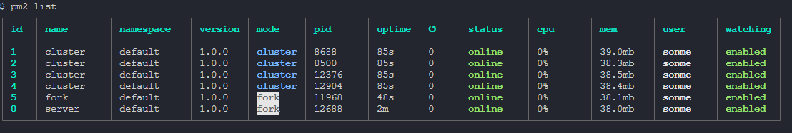

LISTA DE PROCESOS CON FOREVER

info:    Forever processes running
data:        uid  command                            script                                                                        forever pid  id logfile                          uptime
data:    [0] Reio "C:\Program Files\nodejs\node.exe" C:\\DesafioNginx\server.js 8080 cluster 8928    2596    C:\Users\sonme\.forever\Reio.log 0:0:2:30.22
data:    [1] WvwM "C:\Program Files\nodejs\node.exe" C:\\DesafioNginx\server.js 8081         7792    3972    C:\Users\sonme\.forever\WvwM.log 0:0:1:57.485
data:    [2] P5Sv "C:\Program Files\nodejs\node.exe" C:\DesafioNginx\server.js 8082         13588   7716    C:\Users\sonme\.forever\P5Sv.log 0:0:1:31.848

LISTA DE PROCESOS CON PM2

pm2 start server.js --name="cluster" -i 4 --watch -- 8080 cluster

pm2 start server.js --name="fork" --watch -- 8082 fork

